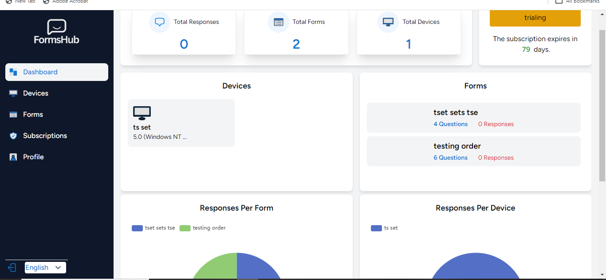
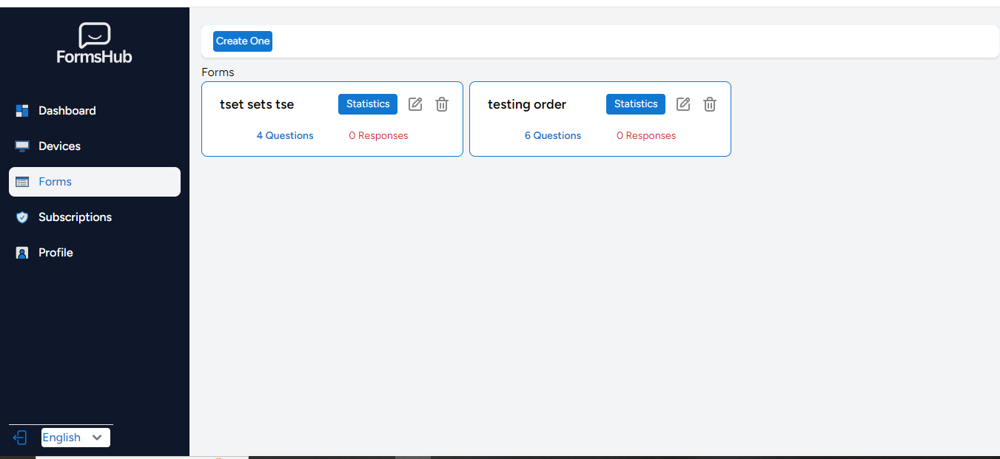
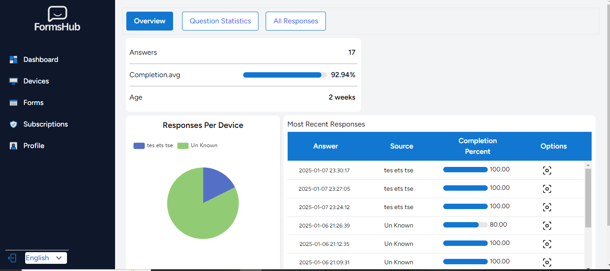

## Survey Building and Kiosk System
A platform developed to enable users to create, manage, and analyze surveys, with integrated kiosk functionality and real-time data visualization.

### My Contributions
- Designed and implemented a backend system using Laravel to manage surveys and user data.
- Developed a user-friendly frontend interface using Vue.js.
- Integrated kiosk devices for survey display and response collection.
- Built real-time data visualization features using Chart.js/D3.js.

### Technologies
- Backend: Laravel, MySQL
- Frontend: Vue.js, Tailwind CSS
- Tools: Docker, RESTful APIs

### Key Achievements
- Improved survey response rates by 30% through optimized user experience.
- Reduced data processing time by 40% with efficient database queries and caching.

## Screenshots

### Add Device

### Dashboard

### Edit Content Form

### Edit Device

### Forms

### Statistics

